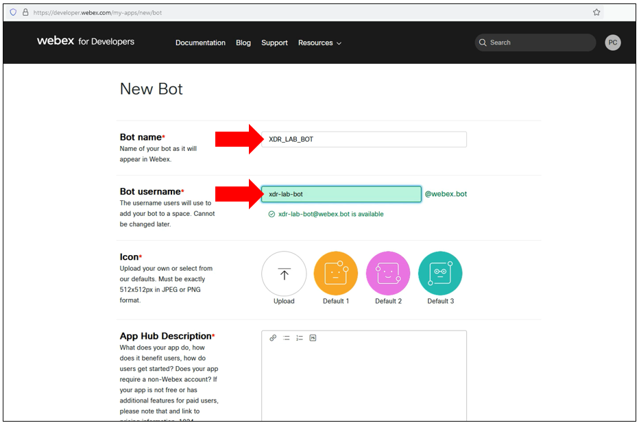

# Create a Webex bot for XDR Alerts

Webex  Bot are very good interfaces for applications which doesn't have any GUI or output console ( Python scripts or XDR Workflows for examples ). It is worth it to understand how we could use it in our Networking and Security Applications.

The benefits of using a Webex bot is that it will have a permanent Webex Bearer Token. And we need this for XDR Automation.
The goal for us is to make XDR able to send message ( info or alerts ) into a webex alert room. So we are  going to give to XDR a permanent Webex Token !

## Create a Webex Bot

Let's create the bot.

Let's go to [Cisco Webex for Developper]('https://developer.webex.com/my-apps')

 

Click on the **start building apps** button and create an new application

Fill all requested fields and create your new bot.

Once created **COPY THE WEBEX BOT TOKEN !!**  and copy the bot mail as well.

At this point we are ready to use an Webex Alert Room 

## The Webex Alert Room

In this current use case we are not going to create a space where the Webex Bot and every security operator will join. 

But, as the Webex Alert Room , we are going to use the webex conversation room we are going ( as a webex user ) to use to interact with the Bot exactly as with anyother webex user.

Every other Security Operators will have to do the same. The bot logic we are going to associate to the bot will manage this multi users conversations. Every message sent by the bot will be received by every operator the bot is in conversation with.

And every operator will be able to send action requests directly to the bot. Or will be able to answer to Bot Alerts.

This is a very easy principle. Every operators just have to contact the bot to receive its alerts. 

So the instruction for creating the alert room is to contact the BOT thanks to the mail it was assign during it's creation. 

Contact the Bot from your webex client and say hello :-)

And that's it !!
